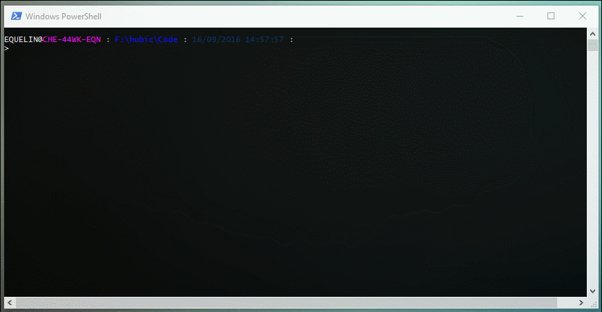

[](https://ci.appveyor.com/project/equelin/unity-powershell) [](https://badge.fury.io/gh/equelin%2FUnity-Powershell)

# Unity-Powershell

This is a PowerShell module for managing EMC Unity arrays (physical or virtual).
Unity-Powershell is a member of the DevHigh5 program from [{code} by Dell EMC(tm)](https://github.com/codedellemc/codedellemc.github.io/wiki/DevHigh5-Program-Overview-and-FAQ).



With this module (version 0.10.0) you can manage:

- System (DNS,NTP...)
- Pools (Virtual and physical deployment)
- Fast Cache (Physical deployment only)
- LUN (block)
- VMware LUN (block and NFS)
- NASServer
- Filesystem
- CIFS Server and Shares
- NFS Server and Shares
- vCenter and ESXi servers
- iSCSI parameters

More functionalities will be added later.

# Usage

This module try to mimic VMware PowerCLI usage. All resources management functions are available with the powershell's verbs GET, NEW, SET, REMOVE. 
For example, you can manage Pools with the following commands:
- Get-UnityPool
- New-UnityPool
- Set-UnityPool
- Remove-UnityPool

Some functions accept pipelining. For example, if you want to delete all the existing LUNS you can do this:

```powershell
Get-UnityLUN | Remove-UnityLUN
```

# Requirements

- Powershell 5 (If possible get the latest version)
- An EMC Unity array ! (virtual or physical)

# Instructions
### Install the module
```powershell
#Automated installation (Powershell 5):
    Install-Module Unity-Powershell

# Or manual setup
    # Download the repository
    # Unblock the zip
    # Extract the Unity-Powershell folder to a module path (e.g. $env:USERPROFILE\Documents\WindowsPowerShell\Modules\)

# Import the module
    Import-Module Unity-Powershell  #Alternatively, Import-Module \\Path\To\Unity-Powershell

# Get commands in the module
    Get-Command -Module Unity-Powershell

# Get help
    Get-Help Get-UnityUser -Full
    Get-Help Unity-Powershell
```

# Examples
### Connection to the Unity array

The first thing to do is to connect to an EMC Unity array with the command `Connect-Unity`:

```PowerShell
# Connect to the Unity array
    Connect-Unity -Server 192.168.0.1

    Server       User  Name     Model    SerialNumber
    ------       ----  ----     -----    ------------
    192.168.0.1 admin UnityDemo UnityVSA VIRT1919K58MXM
```

The parameter `-TrustAllCerts` allow to accept or not untrusted certificates. It is set to `$True` by default.

```PowerShell
# Connect to the Unity array without allowing untrusted certificates
    Connect-Unity -Server 192.168.0.1 -TrustAllCerts $false

    Server       User  Name     Model    SerialNumber
    ------       ----  ----     -----    ------------
    192.168.0.1 admin UnityDemo UnityVSA VIRT1919K58MXM
```

### LUN Management

You can create a new LUN `New-UnityLUN`, retrieves informations `Get-UnityLUN`, modify his properties `Set-UnityLUN` or delete it `Remove-UnityLUN`

```PowerShell
# Create a block LUN
    New-UnityLUN -Name 'LUN01' -Pool 'pool_1' -Size '10GB'

    Id    Name  Pool          IsThinEnabled TieringPolicy SizeTotal   SizeAllocated Type
    --    ----  ----          ------------- ------------- ---------   ------------- ----
    sv_94 LUN01 @{id=pool_1} True          Autotier_High 10737418240 0             Standalone


# Retrieve informations about block LUN
    Get-UnityLUN

    Id    Name  Pool          IsThinEnabled TieringPolicy SizeTotal   SizeAllocated Type
    --    ----  ----          ------------- ------------- ---------   ------------- ----
    sv_94 LUN01 @{id=pool_1} True          Autotier_High 10737418240 0             Standalone
    sv_95 LUN02 @{id=pool_1} True          Autotier_High 10737418240 0             Standalone


# Delete a LUN
    Remove-UnityLUN -ID 'sv_95'
```

### Users Management

You can add a new user `New-UnityUser`, modify his properties `Set-UnityUSer` or delete it `Remove-UnityUser`.

```PowerShell
# Retrieve informations about a specific user
    Get-UnityUser -Name 'demo'

    Id        Name Role
    --        ---- ----
    user_demo demo @{id=storageadmin}

# Change the role of the user from storageadmin to operator
    Get-UnityUser -Name 'demo' | Set-UnityUser -Role 'operator'

    Id        Name Role
    --        ---- ----
    user_demo demo @{id=operator}  

# Delete an user
    Remove-UnityUser -ID 'user_demo'
```

### Query ressources

For testing purpose you can query all the ressources of the array with the command `Get-UnityItem`. You have to provide the URI of the ressource with the parameter `-URI`. It will returns a powershell object or a JSON item (with the parameter `-JSON`)without any formatting.

```PowerShell
# Retrieve informations about ntp servers. Result is a powershell object
    $response = Get-UnityItem -URI '/api/types/ntpServer/instances?fields=id,addresses'
    $response.entries.content

    id addresses
    -- ---------
    0  {pool.ntp.org}

# Retrieve informations about ntp servers. result is in the JSON format
    $response = Get-UnityItem -URI '/api/types/ntpServer/instances?fields=id,addresses' -JSON
```

### Disconnection

```PowerShell
# Disconnect from the EMC Unity Array
    Disconnect-Unity
```

# Author

**Erwan Quélin**
- <https://github.com/equelin>
- <https://twitter.com/erwanquelin>

# Special Thanks

- David Muegge for his [blog post](http://muegge.com/blog/emc-unity-rest-api-powershell/) about using EMC Unity API with powershell
- Warren F. for his [blog post](http://ramblingcookiemonster.github.io/Building-A-PowerShell-Module/) 'Building a Powershell module'
- [Chris Wahl](http://wahlnetwork.com) for his blog posts about powershell and REST API.

# License

Copyright 2016 Erwan Quelin and the community.

Licensed under the MIT License.
